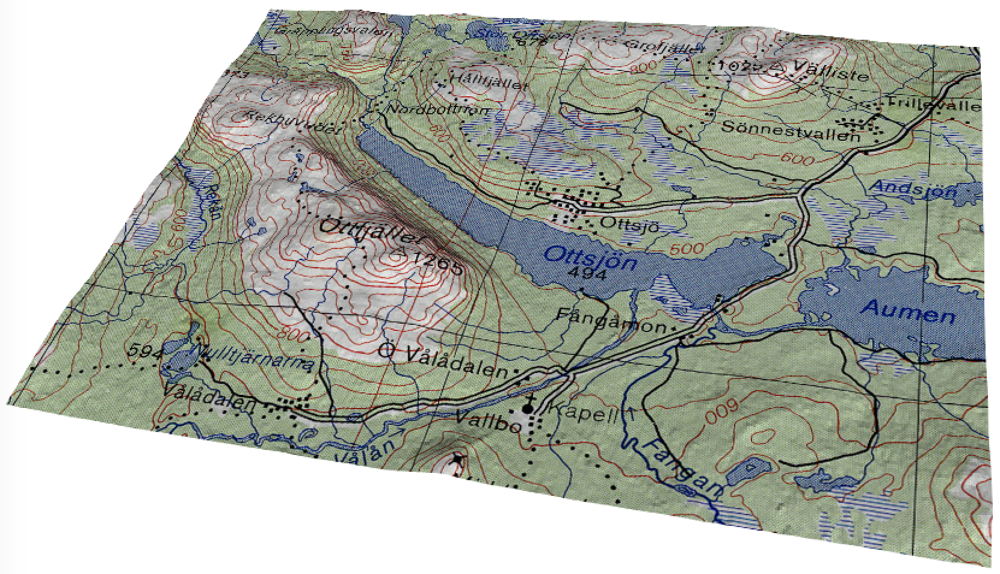

# Labo 5 - Planeur

<figure class="video_container">
  <iframe src="https://www.youtube.com/watch?v=gV4vb7tpLMA&feature=youtu.be" frameborder="0" allowfullscreen="true"> </iframe>
</figure>

Le but de ce laboratoire est de visualiser le parcours d'un planeur décollant depuis le lac gelé de Ottsjön en Suède. Le vol de ce planeur nous permettra par ailleurs de visualiser les flux d'air ascendant et descendant sous l'influence du relief des montagnes environnantes. 

*The glider was flying in the Swedish mountains in conditions glider pilots refer to as wave lift. The glider took off at 10:35am from a frozen lake at an altitude of 500m above sea level and was towed by a tow plane to 950m and released. As can be seen from the data the glider then climbed in the wave lift to a maximum of 1782m at 10:52am. This wave lift is formed in the lee of mountains when the air bounces up and down following its ascent over the mountain. A glider flying in these conditions can gain altitude by flying in the rising air and avoiding the sinking air. Gliders can reach extraordinary heights – the world record is over 15km – much higher than commercial airliners that fly at around 10-12km.*

Pour ce laboratoire, vous disposez des données suivantes:

**Le fichier vtkgps.txt** contenant 1339 points du relevé GPS de ce vol. Une ligne de ce fichier ressemble typiquement à 

T 1361700 7013468    512.5 03/17/02 10:35:35 0      816       78    0.0

Les valeurs 1361700 7013468 indique les coordonnées géographiques dans le système de coordonnées [RT90 (Swedish Grid)](https://en.wikipedia.org/wiki/Swedish_grid). La valeur 512.5 correspond à une altitude en mètres. 03/17/02 10:35:35 donnent la date et l'heure. Le reste des données n'est a priori pas nécessaire. 

**L'image glider_map.jpg** de 1024x768 pixels, une carte de la région. Les coordonnées RT90 de ses 4 coins sont 

- Haut-gauche: 1349340 7022573
- Haut-droite: 1371573 7022967
- Bas-droite: 1371835 7006362
- Bas-gauche: 1349602 7005969 

Les données d'élévation du terrain dans cette région sont disponibles via le site http://www.earthenv.org/DEM.html sous la forme de carrés de 6000x6000 valeurs couvrant 5x5 degrés de latitude x longitude. Les données sont stockées en format binaire sous la forme d'entiers signés sur 16 bits représentant l'altitude en mètres. Vous le lirez aisément avec le package numpy. Vous devez sélectionner parmi ces données celles qui correspondent à la carte ci-dessus.

Pour convertir les coordonnées entre les systèmes RT90 de la grille suédoise et WGS84 qui donne les latitudes et longitudes, vous pouvez utiliser le site du [World Coordinate Converter](http://twcc.fr/en/) pour quelques conversions simples, mais il sera sans doute nécessaire d'installer le [package python pyproj](https://pypi.org/project/pyproj/) permettant d'effectuer ces conversions dans python.

Votre visualisation doit contenir au minimum le relief 3D du terrain correspondant à la carte fournie, avec cette carte visible sur ce relief par texture mapping. Elle doit permettre de visualiser le trajet effectué par le planeur lors de ce vol, ainsi que les flux d'air ascendant et descendant rencontrés par ce planeur. Eventuellement ces deux aspects peuvent être visualisés dans deux visualisations différentes. Vous avez le libre choix de la méthode de visualisation. 

